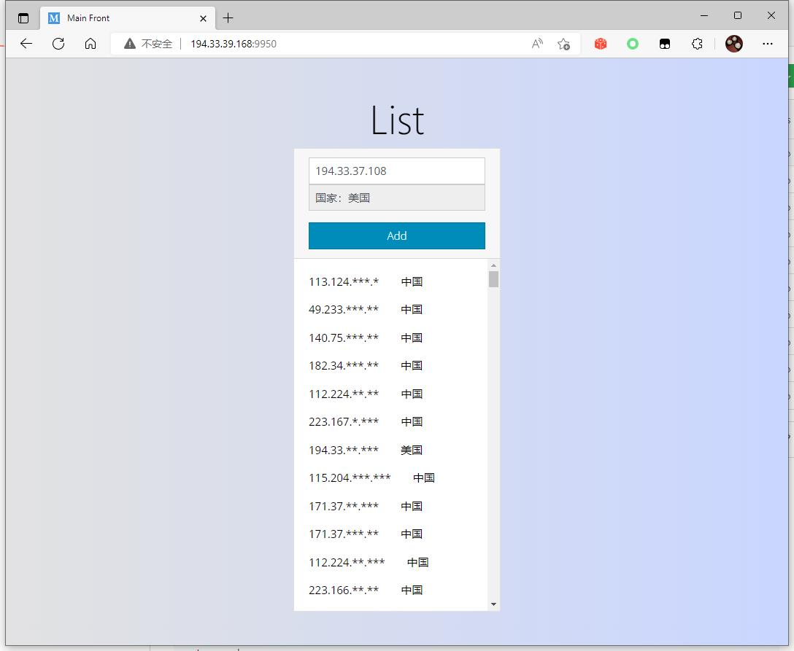

# What's the pywall ?

python 简易防火墙管理程序：pywall

默认端口：**9950**

默认地址：http://**IP**:**PORT**:9950

 

## pywall 安装过程

下面以 Debian 10、11 举例。

- python 要求 3.6+

```
apt update

apt upgrade -y

apt install python3-pip -y

pip3 install --upgrade pip

```

验证安装情况

```
python3 -V

pip3 -V
```

## 安装防火墙
```
# 卸载 ufw，不使用ufw
ufw disable
apt-get remove ufw
apt-get purge ufw

# 安装或升级 iptables
apt-get install iptables -y
apt-get install iptables-persistent -y

# 如果有警告窗口，选择 Yes 即可


# 部分debian系统需要切换 iptables 版本
# iptables-nft和iptables-legacy这两个iptables使用了不同的内核模块
# 输入下面命令，准备切换 iptables 版本
update-alternatives --config iptables


# 屏幕打印出以下内容：
  Selection    Path                       Priority   Status
------------------------------------------------------------
* 0            /usr/sbin/iptables-nft      20        auto mode
  1            /usr/sbin/iptables-legacy   10        manual mode
  2            /usr/sbin/iptables-nft      20        manual mode

# 上面 星号 默认选择的 iptables-nft 版本，我们准备使用 iptables-legacy 版本。
# 找到 /usr/sbin/iptables-legacy 输入对应的数字： 1

# 设置成功后，屏幕输出以下内容：
# update-alternatives: using /usr/sbin/iptables-legacy to provide /usr/sbin/iptables (iptables) in manual mode
```

## 安装本程序 pyfw

```
cd /usr
```

```
apt install git curl wget

git clone https://github.com/xifanu/pywall.git

cd /usr/pywall

chmod +x *.py
chmod +x *.sh
```

## 安装依赖

```
pip3 install -r requirements.txt
```

## 临时启动

```
# 临时启动验证，有 warning 警告没关系，程序正常运行即可。
python3 app.py
```

## 开机自启

注册 systemd 服务

```
cd /etc/systemd/system

vi pywall.service
```

复制粘贴以下内容

```
[Unit]
Description=My Pywall
After=syslog.target network.target nss-lookup.target

[Service]
Type=simple
ExecStart=/usr/bin/python3 /usr/pywall/app.py
Restart=on-failure
RestartSec=5s

[Install]
WantedBy=multi-user.target
```

使其生效

```
systemctl daemon-reload

systemctl enable pywall
```
